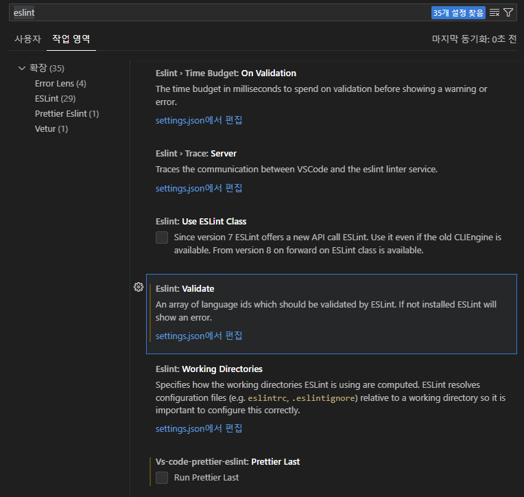

<!-- prettier-ignore -->
# inflearn-vue3-basic2

## 프로젝트 구조 살펴보기
- vite.config.js : vite의 환경 설정 파일
- App.vue : root컴포넌트

## 컴포넌트 구조 이해하기 

처음에 애플리케이션 실행시에

1. index.html 실행 -> 그러면 script에 선언된 main.js (메인 모듈)을 가져옴

2. main.js 실행
- createApp(App).mount('#app') : vue 인스턴스를 생성하는 매서드, 여기서 createApp(App) -> 는 루트컴포넌트 실행을 의미함 -> 그리고 생성된 뷰인스턴스를 #app위치에 마운트함 -> 여기서 #app 이 위치는 index.html파일의 div.id="app" 위치임

3. 결론
- index.html 안에 루트컴포넌트가 랜더링 됨

## eslint, prettier 설정하기

1. .eslintrc.cjs 파일에 rules 추가

```sh
rules: {
		'no-console': process.env.NODE_ENV === 'production' ? 'error' : 'off',
		'no-unused-vars': 'off',
		'prettier/prettier': [
			'error',
			{
				singleQuote: true,
				semi: true,
				useTabs: true,
				tabWidth: 2,
				trailingComma: 'all',
				printWidth: 80,
				bracketSpacing: true,
				arrowParens: 'avoid',
				endOfLine: 'auto', // 한줄 추가
			},
		],
	},
```
2. format on save 설정

- vscode 설정 > eslint 검색 > 작업영역 탭 클릭 > eslint:validate > settings.json에 편집 클릭




- settings.json에 추가한 옵션 내용
```sh
{
    "eslint.validate": [
        "javascript",
        "javascriptreact",
        "typescript",
        "typescriptreact",
        // "html",  // 삭제
        "vue",
        "markdown"
    ],
    "editor.codeActionsOnSave": {
        "source.fixAll.eslint": true
    },
    "editor.tabSize": 2,
    "vs-code-prettier-eslint.prettierLast": false,
}
```

- vscode 설정 > format on save 검색 > 작업영역 탭 > 해당 항목 체크 해제(충돌 방지)

3. markdown 파일 충돌 예외 처리
- md파일과 같은 위치에 .prettierignore 파일 생성, 파일에 '*.md' 내용 추가
-> md 파일에 '<!-- prettier-ignore -->' 주석 추가


## Project Setup

```sh
npm install
```

### Compile and Hot-Reload for Development

```sh
npm run dev
```

### Compile and Minify for Production

```sh
npm run build
```

### Lint with [ESLint](https://eslint.org/)

```sh
npm run lint
```
